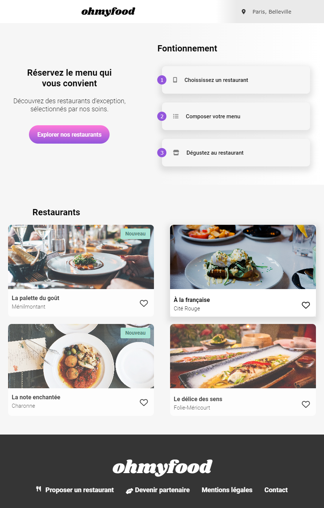

# ohmyfood
Openclassroom Projet 3 Dynamisez une page web avec des animations CSS

Scénario
-	Recruté en tant que développeur junior chez Ohmyfood !
-	Site 100% mobile
-	Répertorie les menus de restaurants gastronomiques
-	Système classique de réservation
-	Composer le menu de leur repas pour que les plats soient prêts à leur arrivée

Membre de l'équipe :
-	Paul, le CTO
-	Fanny, l’UX designer
-	Anissa, commerciale
-	Moi, chargé du développement du site.

Evènement A :
-	Anissa a recruté 4 restaurants
-	Elle m'envoie le dossier avec les 4 menus
-	Un brief avec le CTO, Paul.
-	Fanny m'envoie les maquettes du site.
-	Versionner

Le brief créatif avec Paul le CTO

Marque Identité 
-	Ohmyfood !
-	Entreprise de commande de repas en ligne.
-	Concept composer leur propre menu et réduire leur temps d’attente

Proposition
-	Menus de restaurants gastronomiques
-	Développé à New-York
-	Elargir concept à la capitale de la gastronomie : Paris
Positionnement

-	Marché de niche,
-	Restaurants luxueux
-	Services haut de gamme
Concurrence

-	Mylittlefoodie
-	LebonParis

Cible
-	Classes moyennes et supérieures, connectées et souvent pressées, souhaitant déguster des produits de qualité
Identité graphique
-	Logo et titres : Shrikhand
-	Texte : Roboto

Couleurs:
Primaire Secondaire Tertiaire
#9356DC  #FF79DA    #99E2D0

Problématique
-	Phase 1 Développer un site proposant le menu de 4 grands restaurants parisiens
-	Phase 2 Permettre la réservation en ligne et la composition de menus.

Budget
-	20 000 €

Planning
-	Première version du site : sous 1 mois.
-	Deuxième version du site : sous 6 mois

Technologies
-	CSS, sans JavaScript.
-	Aucun framework
-	Utilisation de SASS
-	Aucun code CSS dans une balise HTML
-	Versionner sur GitHub et diffuser sur Github Pages

Compatibilité
-	Mobile-first
-	Tablette et desktop la mise en page est libre
-	Responsive
-	Validation W3C en HTML et CSS sans erreur.
-	Compatible Chrome et Firefox

Livrables attendus

Contenu des pages

Page d’accueil (x1)
-	Affichage de la localisation des restaurants.
-	Une courte présentation de l’entreprise.
-	Une section contenant les 4 menus sous forme cartes. Au clic sur la carte, l’utilisateur est redirigé vers la page du menu.

Pages de menu (x4)
-	4 pages contenant chacune le menu d’un restaurant.
Footer

-	Le footer est identique sur toutes les pages.
-	Au clic sur “Contact”, un renvoi vers une adresse mail est effectué.
Header

-	Le header est présent sur toutes les pages.
-	Sur la page d’accueil, il contient le logo du site.
-	Sur les pages de menu, il contient en plus un bouton de retour vers la page d’accueil

Effets graphiques et animations
-	Pas de JavaScript ni de librairie
-	Animations ou transitions CSS
-	Au clic ou au survol

Boutons
-	Au survol, la couleur de fond des boutons principaux devra légèrement s’éclaircir. L’ombre portée devra également être plus visible.
-	À terme, les visiteurs pourront sauvegarder leurs menus préférés. Pour ça, un bouton "J’aime" en forme de cœur est présent sur la maquette. Au clic, il devra se remplir progressivement. Pour cette première version, l’effet peut être apparaître au survol sur desktop au lieu du clic

Page d’accueil
-	"loading spinner" 1 à 3 secondes quand on arrive sur la page d'accueil, ouvrir l'intégralité de l'écran en animations CSS

Pages de menu
-	À l’arrivée sur la page, les plats devront apparaître progressivement avec un léger décalage dans le temps. Ils pourront soit apparaître un par un, soit par groupe “Entrée”, “Plat” et “Dessert”. Un exemple de l’effet attendu est fourni
-	Le visiteur peut ajouter les plats qu'il souhaite à sa commande en cliquant dessus. Cela fait apparaître une petite coche à droite du plat. Cette coche devra coulisser de la droite vers la gauche. Pour cette première version, l’effet peut apparaître au survol sur desktop au lieu du clic. Si l’intitulé du plat est trop long, il devra être rogné avec des points de suspension. Un exemple de l’effet attendu est fourni.

Organisation interne du projet
-	Chef de projet : Paul
-	UX Designer : Fanny
-	Circuit de validation : toutes les étapes du projet seront validées par Paul.

Livrables
-	Un fichier au format TXT contenant le lien vers votre repository GitHub ;
-	Un fichier au format TXT contenant le lien vers la page web du site.
-	Titre_du_projet_nom_prénom
-	Nom_Prénom_n° du livrable_nom du livrable__date de démarrage du projet
-	Nom_Prénom_1_code_mmaaaa ;
-	Nom_Prénom_2_site_mmaaaa

Soutenance
-	Présentation des livrables (15 minutes)
-	Expliquer vos choix techniques concernant la conception du site

Discussion (10 minutes)
-	Répondre aux questions de Paul

Debrief (5 minutes)

Compétences évaluées
-	Mettre en place une structure de navigation pour un site web
-	Mettre en place son environnement Front-End
-	Assurer la cohérence graphique d'un site web
-	Mettre en œuvre des effets CSS graphiques avancés
-	Utiliser un système de gestion de versions pour le suivi du projet et son hébergement

Ressources

https://buzut.net/cours/versioning-avec-git/bien-nommer-ses-commits

https://grafikart.fr/formations/git

https://grafikart.fr/formations/sass-preprocesseur

https://openclassrooms.com/fr/courses/7688581-devenez-un-expert-de-git-et-github
